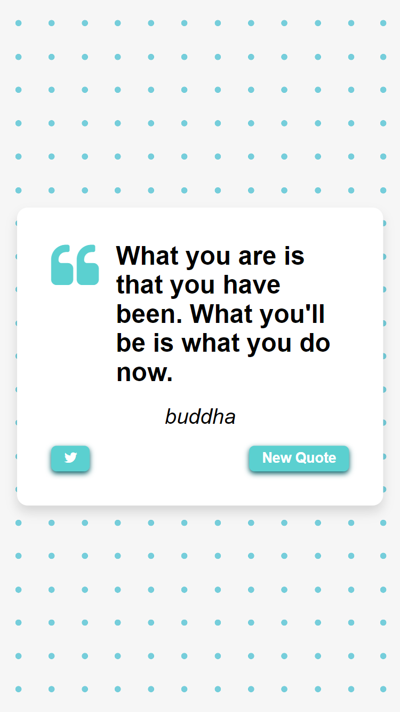

# Quote Generator App | Js-20

## Introduction

Welcome to Quote Generator App

This repository contains the web app I coding along with a js course where we make 20 js projects and learn about different js concepts and web APIs by following along.
This is my 3nd project in this series.

- **Live Link:** [Link](https://mbilal-x.github.io/js-20__quote-generator)
- **Code Link:** [Link](https://github.com/mbilal-x/js-20__quote-generator)
- **Screen Shots:**
  
  <!--  -->

## Technologies Used

- HTML
- CSS
- JS
- APIs
  - twitter: To share a tweet
  - forismatic: To get random quotes

## Process

Things I practiced:

- Made the frontend interface, my own design
- making to loader screen
- finding and using quote api
- using the twitter share button api

## Motivation

To improve my skill and understanding of js by building projects alongside tutorials.

## Improvements

To further improve this project:

- more social links can be included
- light and dark mode could be included
- export as wallpaper option can be added
